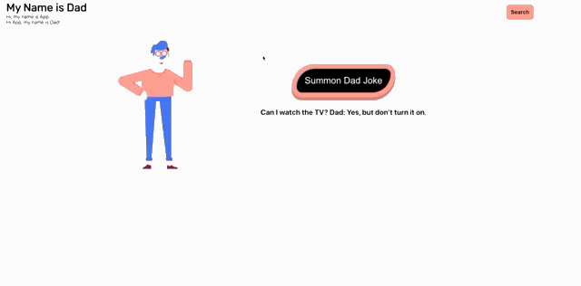
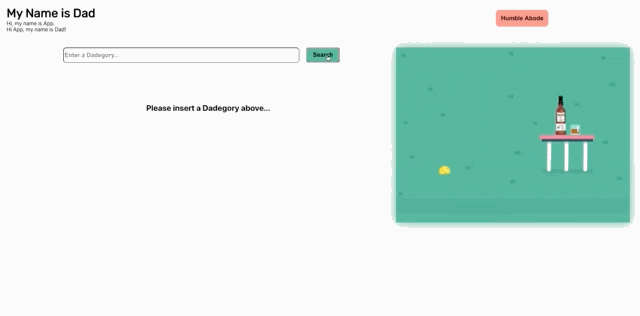

# My Name Is Dad

## Contributors:
* [Julia Iwinski](https://github.com/jgiwinski)
* [Matt McVey](https://github.com/mattmcvey)
* [Joel Thomas](https://github.com/Shakikka)

### Learning Goals:
 * Understand Redux and global state management
 * Further our understanding of React, Router, and Cypress
 * Implement a controlled form
#### Wins:
 * Gained basic understanding of Redux
 * Built confidence with use of Cypress, Router, React, and Controlled Forms / How to implement them
 * Made a site worthy of dad sensibility
#### Challenges:
* Redux has a steep learning curve, and took a bit longer than expected to pickup / understand
* Animations are fun, but sometimes add unexpected problems to development

## Overview of Site:
##### My Name Is Dad is a web app that allows dads and dad enthusiasts to:
  * Get a random dad joke to inspire others around them
  * Search for dad jokes by favorite dadegory
  * Teach new dads how to have a sense of humor
  

### Screenshots / Screen Recordings
#### Humble Abode:

#### Search Page:

### Technologies Used:
* Javacript
* CSS
* Webpack
* [React](https://reactjs.org/)
* [Redux](https://redux.js.org/)
* [React Router](https://reactrouter.com/)
* [Cypress](https://www.cypress.io/)

## Setup
* To access the site on your local machine:
  * Clone down the repo through the command line
  * Run `$npm install` to install dependencies
  * Run `$npm start` to open the page on a local browser
* Otherwise the site is deployed onto heroku and is accessible [here](https://my-name-is-dad.herokuapp.com/) 

## Running Tests
* After completing the setup steps above:
  * Run `$npx cypress open` to open up the test suite
  * From there click on the `DadTests.spec.js` file to open it in your browser and watch the tests run automatically
